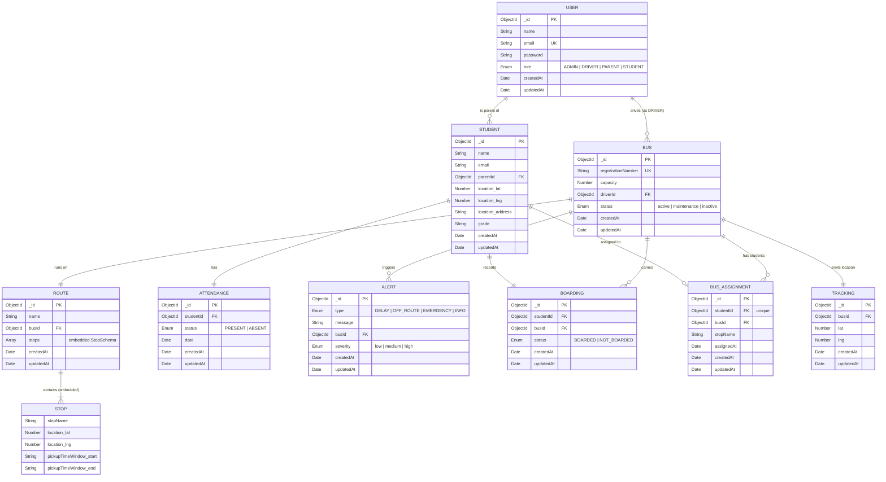

# ER Diagram — Dynamic School Bus Route Optimization & Monitoring System

## Entity-Relationship Diagram

---

## Entities Summary

| # | Entity | Collection | Description |
|---|--------|-----------|-------------|
| 1 | **User** | `users` | All system users — Admins, Drivers, Parents, Students |
| 2 | **Bus** | `buses` | Physical buses with registration, capacity & assigned driver |
| 3 | **Route** | `routes` | Named routes with an assigned bus |
| 4 | **Stop** | *(embedded in Route)* | Individual stop with geolocation & pickup time window |
| 5 | **Student** | `students` | Children linked to a parent User with home location |
| 6 | **Attendance** | `attendances` | Daily PRESENT/ABSENT log per student (unique per student+date) |
| 7 | **Alert** | `alerts` | System alerts (delay, off-route, emergency) optionally linked to a bus |
| 8 | **Boarding** | `boardings` | Real-time boarding status of a student on a specific bus |
| 9 | **BusAssignment** | `busassignments` | Assigns exactly one student to one bus (+ optional stop) |
| 10 | **Tracking** | `trackings` | GPS breadcrumbs for each bus (lat/lng with timestamp) |

---

## Relationship Details

| Relationship | Cardinality | Description |
|-------------|-------------|-------------|
| User → Bus | 1 : 0..N | A Driver user can drive zero or more buses; each bus has one driver |
| User → Student | 1 : 0..N | A Parent user has zero or more students |
| Bus → Route | 1 : 1 | Each route is assigned to exactly one bus |
| Route → Stop | 1 : 1..N | A route contains one or more embedded stops |
| Student → Attendance | 1 : 1 | Each student has exactly one attendance record |
| Student → Boarding | 1 : 1 | Each student has exactly one boarding record |
| Bus → Boarding | 1 : 0..N | Each bus can have many boarding records |
| Student → BusAssignment | 1 : 0..1 | Each student is assigned to at most one bus (unique index) |
| Bus → BusAssignment | 1 : 0..N | Each bus can have multiple students assigned |
| Bus → Tracking | 1 : 1 | Each bus has exactly one tracking record |
| Bus → Alert | 1 : 0..N | Each bus can trigger multiple alerts |

---

## Indexes & Constraints

| Collection | Index | Type | Purpose |
|-----------|-------|------|---------|
| User | `email` | Unique | Prevent duplicate accounts |
| Bus | `registrationNumber` | Unique | Prevent duplicate bus registrations |
| Student | `parentId` | Standard | Fast lookup of students by parent |
| Attendance | `{ studentId, date }` | Unique compound | One attendance record per student per day |
| Boarding | `{ busId, studentId, createdAt }` | Compound | Find student's status on a bus |
| Boarding | `{ busId, createdAt }` | Compound | List all students on a bus |
| BusAssignment | `studentId` | Unique | One bus assignment per student |
| BusAssignment | `busId` | Standard | Find all students on a bus |
| Tracking | `{ busId, createdAt }` | Compound (desc) | Get latest bus location efficiently |
